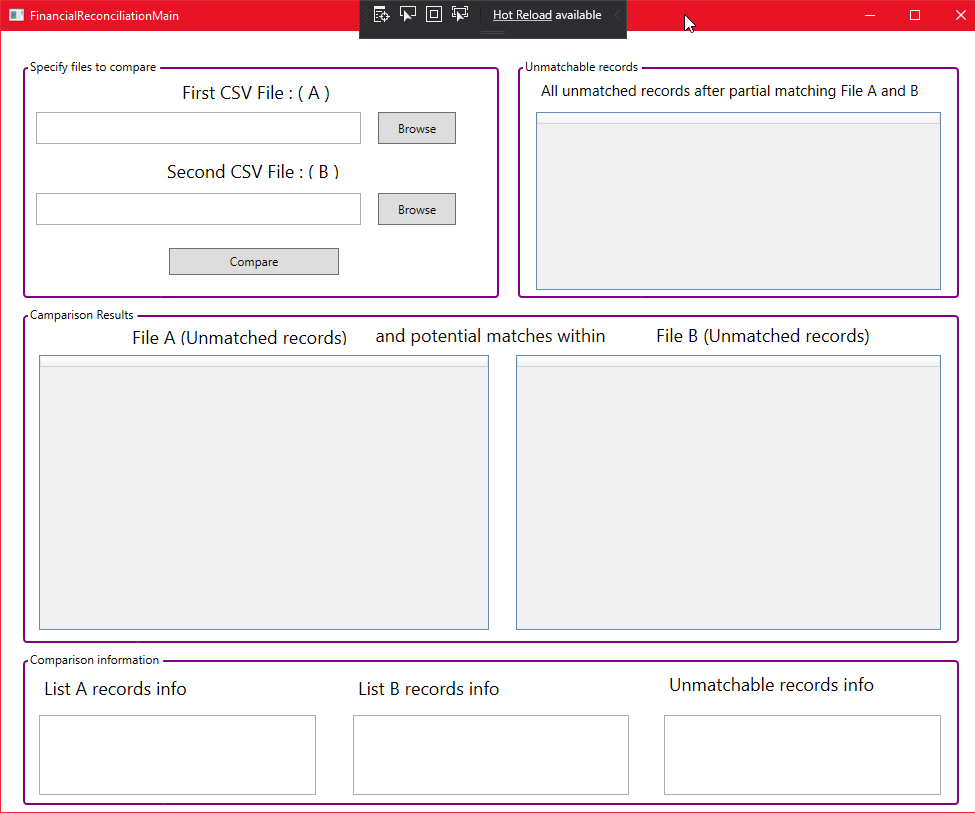
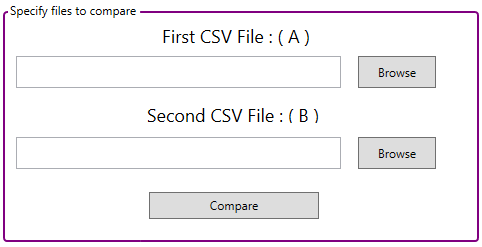
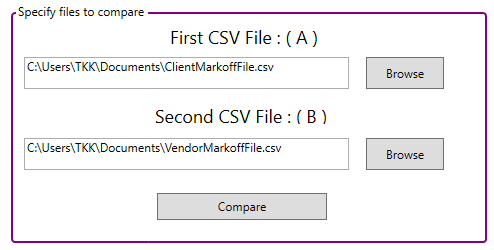
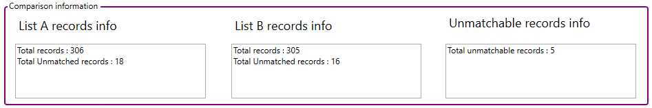
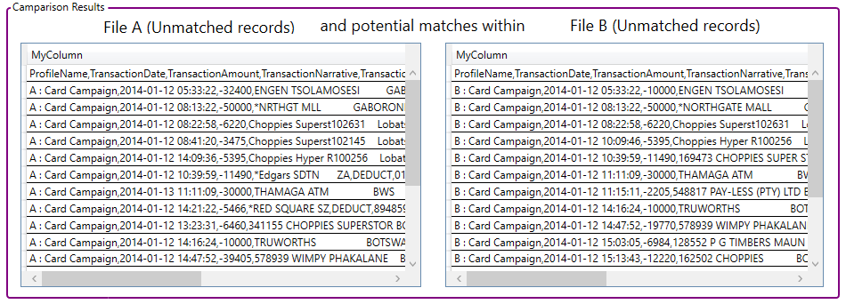
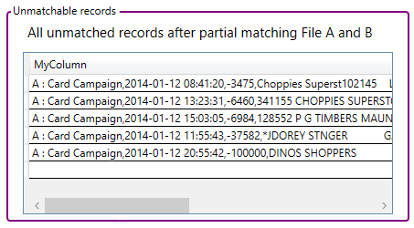

## Financial reconciliation

##### A functional financial reconciliation project that compares / reconciles two loaded CSV Files.

The goal of this project was to create an application that:

* Select local CSV files
* Simple compare the two selected files
  * Find partial matches where records cant compare 1:1
  * Find all unmatchable records that cant be simply or partially matched
* Display records that dont match

#### User guide
##### Main window
The entire application is currently displayed on a single window. (Subject to change)

The first step would be to use the browse function to retrieve the local CSV files.

Once the files are selected, click the "Compare" button to start the reconciliation process.

Comparison information will be displayed at the bottom of the window.

The two selected files will be compared and all records that cant be matched 1:1 will be displayed in their respective table.

These lists are then compared again to find any partial match within the lists. The result will be displayed in its respective table.

This table will display all records that have no found matches, 1:1 or partial.

